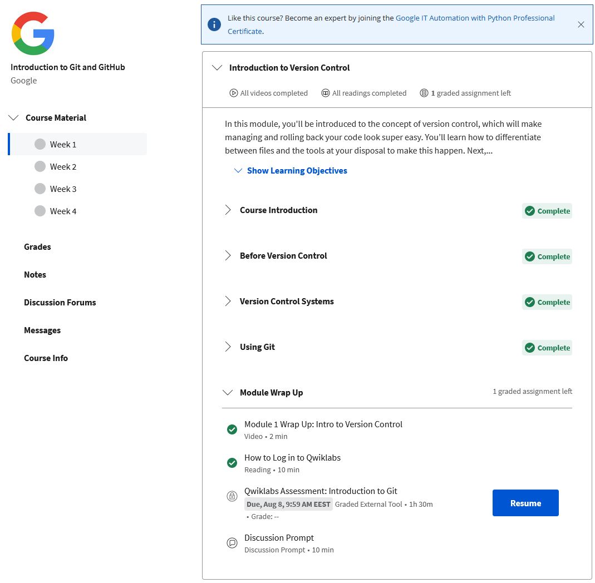
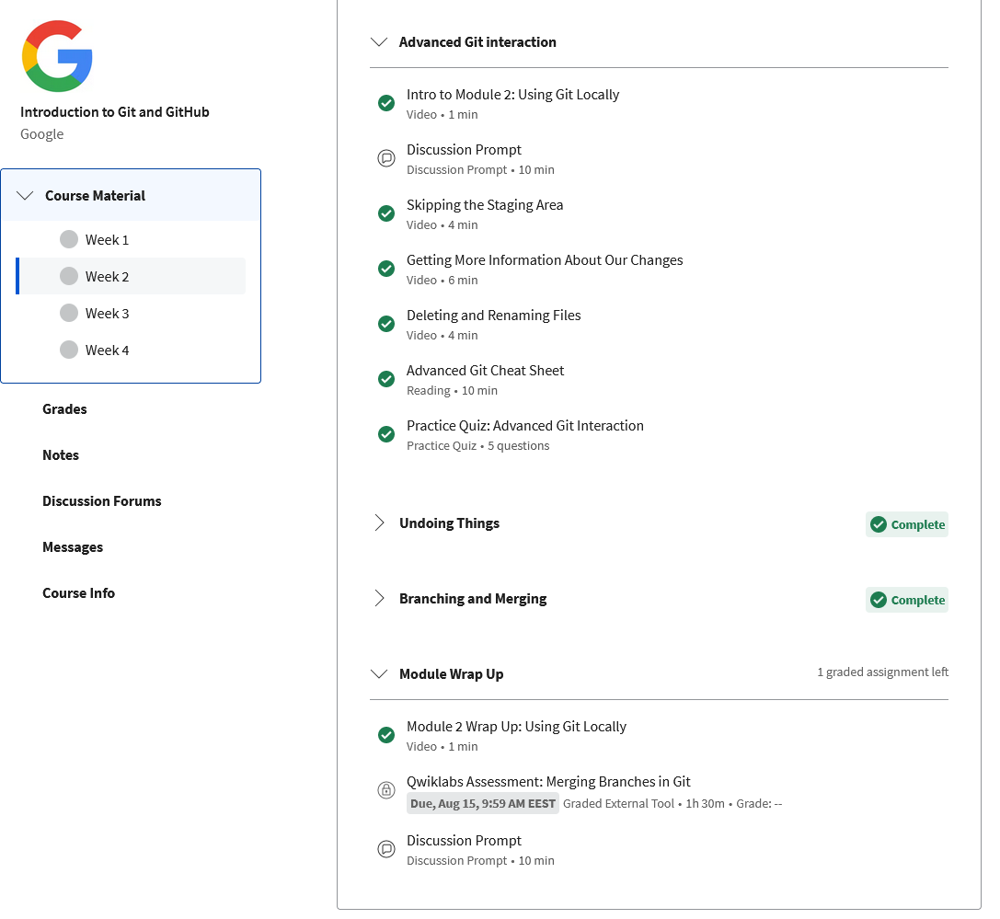
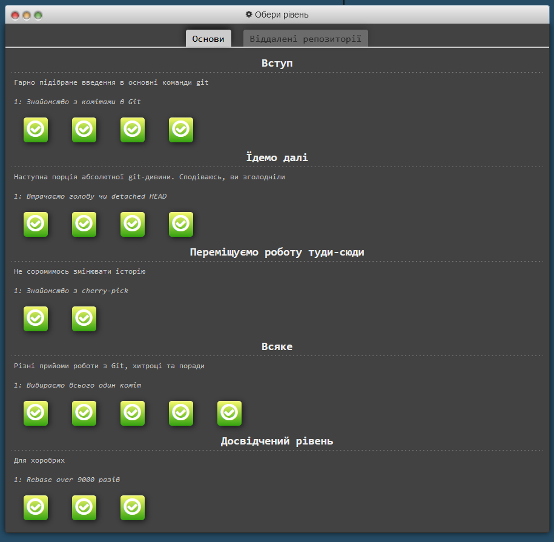
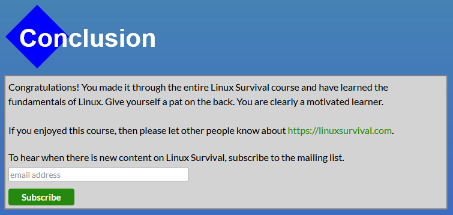
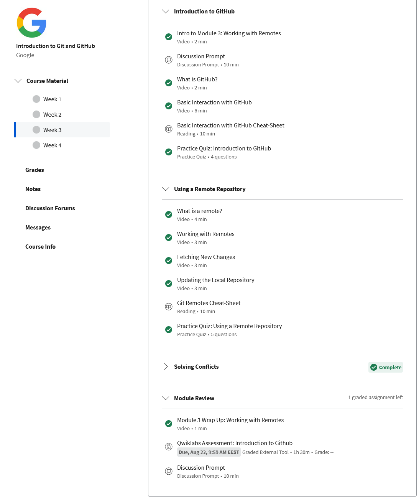
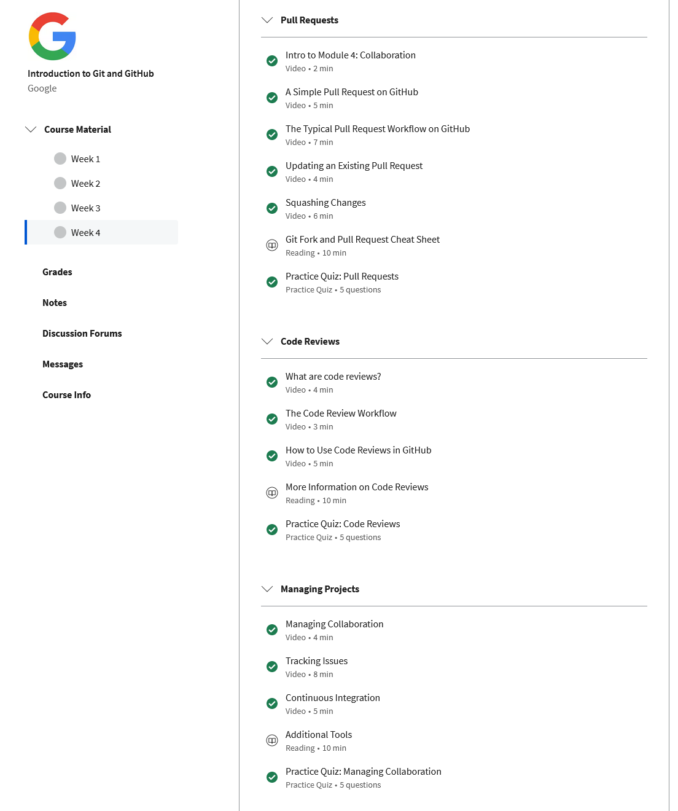
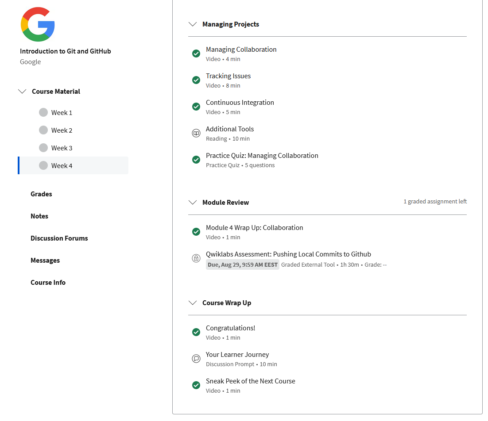
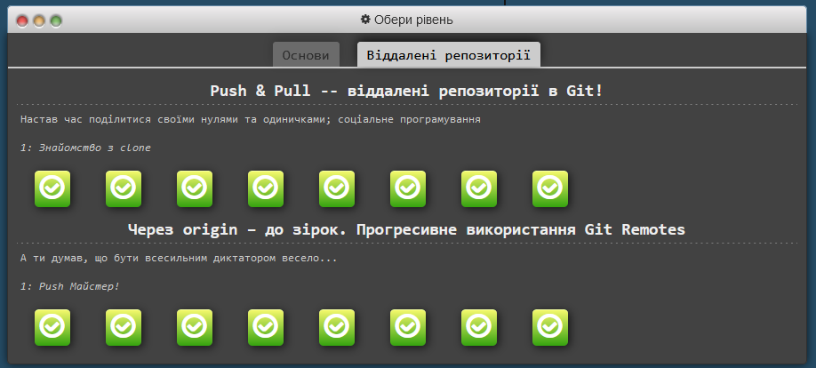

# Kottans frontend cours

This is a crib for [kottans frontend course](https://kottans.org/frontend/). 

## Stage 0

### [Git Intro](https://kottans.org/frontend/tasks/git-intro.html)

[First Steps with Git conspect](lessons/st0ls1_Git.md)

A knew a lot about git branching and so much about working with remote repo. 

### [Linux CLI, and HTTP](https://kottans.org/frontend/tasks/linux-cli-http.html)

[First Steps with Git conspect](lessons/st0ls2_Linux.md)

A worked with linux before, but from this course I learned a lot about basic commands and working with groups and
permissions. Piping is a such cool thing too. 

HTTP protocol is to complicated for me for now, because I do not know how exactly I will be use it in future.
So for now it is some magic stuff. I will return to this material later and finished my conspect for part 2. 

### Git Collaboration

Git is strongly powerful tool. I exiting with issue tracker and how it fused with commits functionality. 